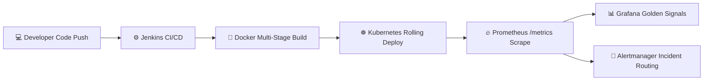

# 🌐 VLE-7: Full DevOps Monitoring System (AWS + K8s + CI/CD + Alerts)

[](Jenkinsfile)
[](k8s/)
[](monitoring/prometheus/)
[](monitoring/grafana/)
[](monitoring/alertmanager/)
[](docs/EXPERIMENT_REPORT.md)
[](tests/)

---

## 📌 Project Overview

This repository contains the complete implementation, infrastructure manifests, continuous integration pipelines, monitoring configurations, and interactive live command center for **Virtual Lab Experiment 7 (VLE-7)**: *Full DevOps Monitoring System (AWS + K8s + CI/CD + Alerts)*.



---

## 🗂️ Project Repository Structure

```text
├── .gitignore
├── Dockerfile                             # Multi-stage production container definition
├── Jenkinsfile                            # Multi-stage declarative CI/CD pipeline
├── README.md                              # Comprehensive repository documentation
├── docker-compose.yml                     # Full local ecosystem runner (App + Prom + Alertmgr + Grafana)
├── package.json                           # Node.js dependencies & scripts
├── server.js                              # Dashboard web server & telemetry gateway
├── docs/
│   └── EXPERIMENT_REPORT.md               # Complete academic VLE-7 lab report & Viva answers
├── k8s/                                   # Kubernetes Manifests
│   ├── configmap.yaml                     # Application environment & configs
│   ├── deployment.yaml                    # 2-replica deployment with probes & limits
│   ├── hpa.yaml                           # Horizontal Pod Autoscaler definition
│   └── service.yaml                       # NodePort service on port 30080
├── monitoring/
│   ├── alertmanager/
│   │   └── alertmanager.yml               # Alertmanager routing tree & receivers
│   ├── grafana/
│   │   ├── dashboards/
│   │   │   └── devops-full-monitoring.json # Production Grafana dashboard model
│   │   └── provisioning/
│   │       ├── dashboards/dashboards.yml
│   │       └── datasources/datasource.yml # Auto-provisioned Prometheus datasource
│   └── prometheus/
│       ├── alert_rules.yml                # Prometheus alert rules (CPU, CrashLoop, 5xx, Down)
│       └── prometheus.yml                 # Scrape configs & alertmanager endpoints
├── public/                                # Modern Dark-Mode Command Center UI
│   ├── app.js                             # Live charts, WebSockets, & pipeline simulator
│   ├── index.html                         # Interactive command center page
│   └── style.css                          # Design tokens & responsive styles
├── scripts/                               # Automation Shell Scripts
│   ├── deploy_k8s.sh                      # K8s manifest apply & dry-run validator
│   ├── deploy_monitoring.sh               # Monitoring stack setup script
│   ├── setup_infra.sh                     # AWS EC2 & Docker runtime initialization
│   ├── simulate_traffic_and_alerts.sh     # Chaos & traffic generation script
│   └── verify_stack.sh                    # End-to-end automated verification script
├── src/
│   └── app.js                             # Express microservice & Prometheus metrics exporter
└── tests/                                 # Automated Test Suites
    ├── alert_rules.test.js                # Prometheus & Alertmanager rule syntax tests
    ├── k8s_validation.test.js             # Kubernetes manifest validation tests
    ├── run_all_tests.js                   # Master test suite runner
    └── unit.test.js                       # Express & Prometheus metric registry unit tests
```

---

## ⚡ Quick Start & Execution Guide

### 1. Run Automated Test Suite
```bash
npm test
```

### 2. Launch Local Interactive Command Center & API Server
```bash
npm start
```
- Open Dashboard in Browser: **`http://localhost:8081`**
- View Raw Prometheus Metrics: **`http://localhost:8081/metrics`**
- Liveness Probe: **`http://localhost:8081/api/health/live`**

### 3. Launch Full Monitoring Ecosystem via Docker Compose
```bash
docker compose up -d
```
| Service | Local URL | Default Credentials |
| :--- | :--- | :--- |
| **DevOps App & UI** | [http://localhost:8081](http://localhost:8081) | N/A |
| **Prometheus TSDB** | [http://localhost:9090](http://localhost:9090) | N/A |
| **Prometheus Alertmanager** | [http://localhost:9093](http://localhost:9093) | N/A |
| **Grafana Dashboards** | [http://localhost:3000](http://localhost:3000) | `admin` / `admin` |

---

## 🔔 Prometheus Alert Rules Summary

| Alert Name | PromQL Expression | Severity | Description |
| :--- | :--- | :--- | :--- |
| **`PodCrashLoop`** | `kube_pod_container_status_restarts_total > 3` | Critical | Pod restarting continuously |
| **`HighCPUUsage`** | `pod_cpu_usage_percent > 85` | Warning | CPU usage exceeded threshold |
| **`NodeDown`** | `up == 0` | Critical | Target unreachable / node failure |
| **`HighHttpErrorRate`** | `rate(http_requests_total{status_code=~"5.."}[2m]) > 5%` | Critical | HTTP 5xx error budget breached |
| **`HighServiceLatency`**| `http_request_duration_seconds{quantile="0.95"} > 1.0` | Warning | P95 latency > 1000ms |

---

## 🎓 Academic Viva Voce Flashcards

Detailed answers for all Viva questions are included in [docs/EXPERIMENT_REPORT.md](docs/EXPERIMENT_REPORT.md) and inside the interactive **Viva Voce & Lab Guide** tab in the web UI.

---

## 👤 Author
**Krishna Rawat**  
DevOps & Cloud Engineering Laboratory
